# Machine Learning Implementation (Neural Networks in C++)

**By: Bern Vein Balermo**  
*Markdown export prepared on August 28, 2025*

> This document is a faithful Markdown version of the original paper, with equations, code, and structure preserved. All extracted figures are saved under `images/` and embedded below where relevant.

---

## Table of Contents
- [I. Project Overview](#i-project-overview)
- [II. Data Sources](#ii-data-sources)
- [III. Methodology](#iii-methodology)
  - [Forward Pass](#forward-pass)
  - [Cost Function](#cost-function)
  - [Backpropagation & Gradients](#backpropagation--gradients)
  - [Parameter Updates](#parameter-updates)
  - [Prediction & Classification](#prediction--classification)
- [IV. Model Performance](#iv-model-performance)
- [V. Overall Insight](#v-overall-insight)
- [VI. Tools and Technologies](#vi-tools-and-technologies)
- [VII. Code Structure](#vii-code-structure)
- [VIII. References](#viii-references)
- [Figures](#figures)

---

## I. Project Overview

The objective is to **classify the type of line** in a user-provided **3×3 grid** by building a simple **neural network from scratch in C++**, without high-level libraries.  
This tackles a common hurdle for students: neural networks are often discussed but their underlying logic and flow remain unclear.  
The goal is to provide a readable, easy-to-follow codebase that **demystifies core NN mechanics**.

## II. Data Sources

A **custom dataset** of 3×3 grids paired with labels indicating the type of line (e.g., *horizontal*, *vertical*, or *diagonal*) was created manually to keep the task focused and interpretable for educational purposes.

## III. Methodology

### Forward Pass

For each training image, compute activations layer by layer using the **sigmoid** activation:

}_{j}=\sigma\!\left(\sum_{i=0}^{n-1}a^{(L-1)}_{i}w^{(L)}_{j,i}+b^{(L)}_{j}\right),\ \sigma(x)=\frac{1}{1+e^{-x}})

**Why sigmoid?**  
It maps inputs to \( (0,1) \), which is convenient when outputs represent **probabilities**.

### Cost Function

Use **Mean Squared Error (MSE)** to measure the difference between predicted and true values:

$$
\mathrm{MSE} = \sum_{j=0}^{n-1} (\hat y_j - a^{(F)}_j)^2.
$$

**Why MSE?**  
By squaring errors, MSE penalizes larger mistakes more strongly, helping guide the network toward precise adjustments during training.

### Backpropagation & Gradients

Compute **output deltas** via the chain rule:

$$
\delta^{(F)}_j = \mathrm{MSE}'(\hat y, a^{(F)}_j) \cdot \sigma'(z^{(F)}_j), 
\quad \text{with } z \text{ the pre-activation (logit).}
$$

Then **propagate deltas backward**:

$$
\delta^{(L)}_j = \Bigg( \sum_i \delta^{(L+1)}_i \, w^{(L+1)}_{j,i} \Bigg) \cdot \sigma'\!\left(z^{(L)}_j\right).
$$

Gradients for **weights** and **biases**:

$$
\frac{\partial C_x}{\partial w^{(L)}_{j,i}} = \delta^{(L)}_j \, a^{(L-1)}_i,
\qquad
\frac{\partial C_x}{\partial b^{(L)}_{j}} = \delta^{(L)}_j.
$$

### Parameter Updates

Update parameters with **gradient descent** (learning rate \(\eta\)):

$$
w^{(L)}_{j,i} \leftarrow w^{(L)}_{j,i} - \eta \, \frac{\partial C_x}{\partial w^{(L)}_{j,i}},
\qquad
b^{(L)}_{j} \leftarrow b^{(L)}_{j} - \eta \, \frac{\partial C_x}{\partial b^{(L)}_{j}}.
$$

Repeat over epochs until the cost is acceptable.

### Prediction & Classification

At inference, apply **softmax** to logits \(\mathbf z\) to obtain class probabilities:

$$
\sigma(\mathbf z)_i = \frac{e^{z_i}}{\sum_{j=1}^{K} e^{z_j}}.
$$

**Why softmax?**  
Ideal for **multi-class** tasks: it produces a probability distribution over classes that sums to 1.

## IV. Model Performance

- **Initial Accuracy:** 14.285714285%  
- **Final Accuracy:** 92.857142857%  
- **Initial Cost:** 0.728637  
- **Final Cost:** 0.000145964

Training accuracy increased quickly and stabilized near **92.86%**.  
The cost decreased **exponentially** to a minimal value, suggesting convergence.  
Training could likely have **stopped around ~500 epochs**, as further improvements were marginal.

If available, see the plots below for **Cost by Epoch** and **Accuracy by Epoch**.

## V. Overall Insight

The model **robustly** classified noisy, real-world-like 3×3 grids with a final accuracy of **92.857%**.  
Minimal cost improvement beyond the **500th epoch** indicates you could adopt **early stopping** without sacrificing performance.  
Using slightly perturbed (noisy) testing inputs helped validate the model’s **generalization** without needing a separate validation set comparison.

## VI. Tools and Technologies

**IDE:** Visual Studio Code; Visual Studio

**Standard C++ Libraries:**
```cpp
#include <iostream>
#include <vector>
#include <cstdlib>
#include <algorithm>
#include <chrono>
#include <windows.h>
```

**Custom Headers:**
```cpp
#include "InputLayer.h"
#include "hiddenLayer.h"
#include "outputLayer.h"
```

**Frameworks:** None (core C++ only).

## VII. Code Structure

**Hyperparameters:**  
- Epochs: **10,000**  
- Learning Rate: **0.1**  
- Input Layer: **8** neurons  
- Hidden Layer: **10** neurons  
- Output Layer: **3** neurons

Training (dataset image) and a **user-input testing** example were used to validate behavior.

### Confusion Matrix

|               | Predicted Diagonal | Predicted Vertical | Predicted Horizontal |
|---------------|--------------------|--------------------|----------------------|
| **Actual Diagonal**   | 4                  | 0                  | 0                    |
| **Actual Vertical**   | 1                  | 5                  | 0                    |
| **Actual Horizontal** | 0                  | 0                  | 4                    |

The model correctly classified most test samples with **only one** misclassification.

## VIII. References

- Baeldung. (2024, March 18). *Random initialization of weights in a neural network*.  
- DataCamp. (2024, October). *Introduction to activation functions in neural networks*.  
- DataCamp. (n.d.). *Loss function in machine learning: Exploring MSE and other approaches*.  
- Machine Learning Mastery. (n.d.). *Using activation functions in neural networks*.  
- Machine Learning Mastery. (n.d.). *Gradient descent and its application in machine learning*.  
- GeeksforGeeks. (n.d.). *The role of softmax in neural networks: Detailed explanation and applications*.

---

## Figures


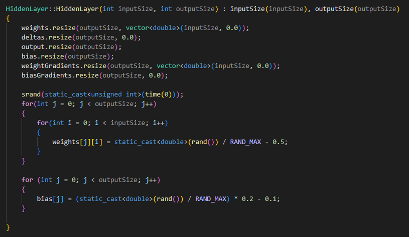

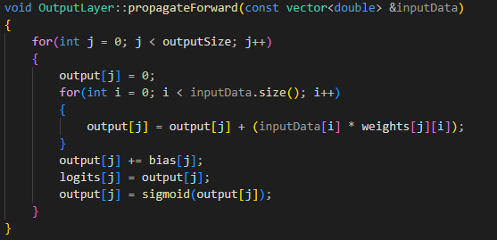

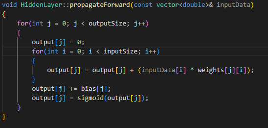


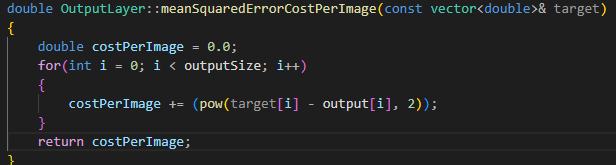

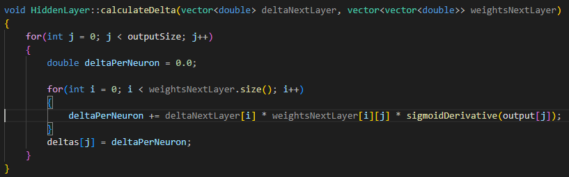

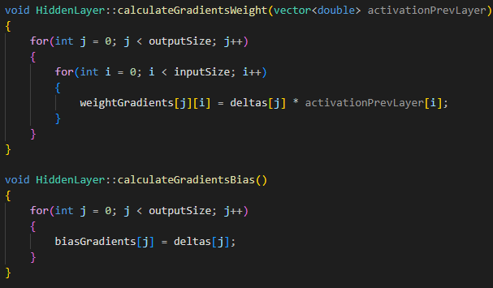

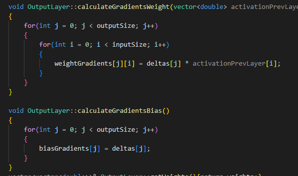

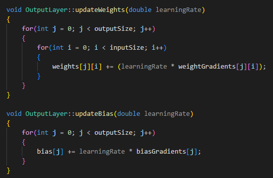

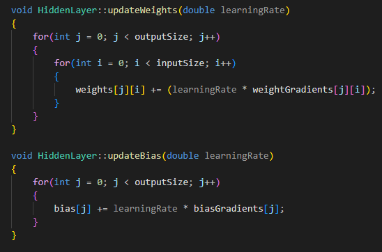

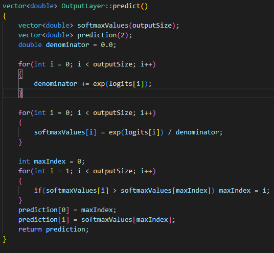

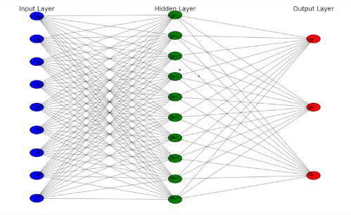

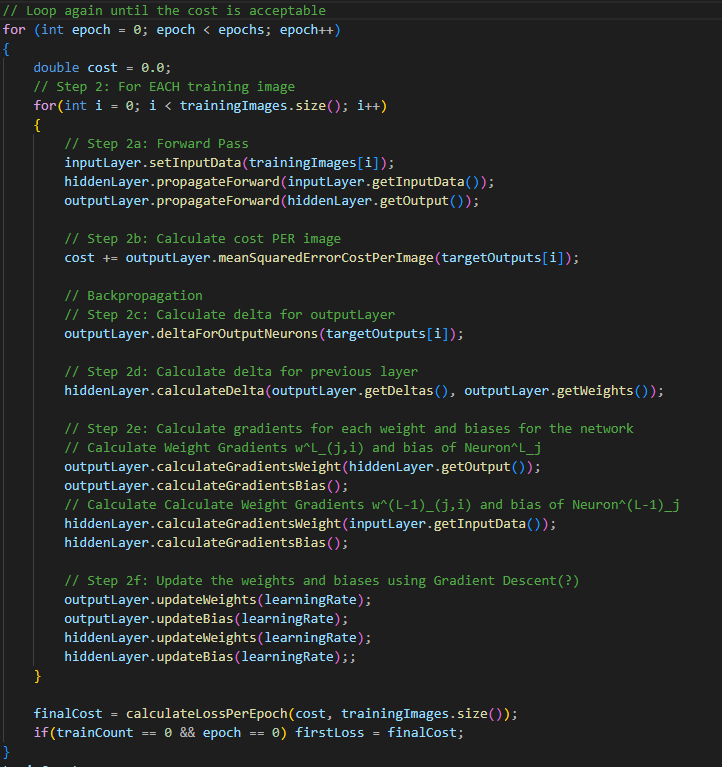

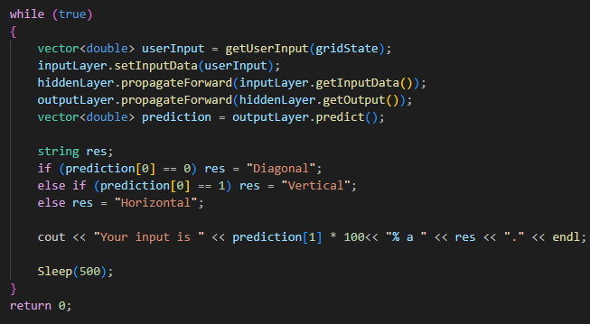
